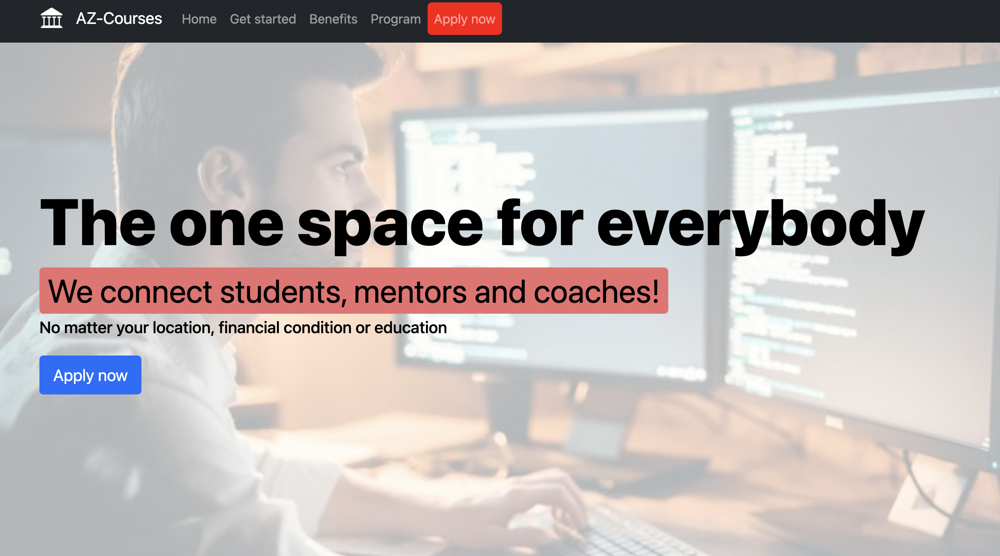

# AZ Courses - the education for everybody.

- This is a platform for students, mentors and coaches, where you pay nothing and get knowlidge and expierence.

- This is a learning platform for all over the region!

## The [Demo Live](https://smc-space.netlify.app/) version is available

### the link to [Backend (Django REST API)](https://github.com/elmar8287/django-backend-API)

## Project status: on going

### In this project I used React JS with hooks:
- useState()
- useEffect()

## Interesting features impelemented:
- Created the contact form by using useState() hook to handle all inputs
- Used useEffect() hook to monitor any changes in inputs and save in localStore
- Used canditional rendering, when the form is submitted (display success message)

### Built with

- React JS
- Django REST API
- Netlify

## Author

- GitHub: [@elmar8287](https://github.com/elmar8287)
- LinkedIn: [Elmar Abdulkarimov](https://www.linkedin.com/in/elmar.abdulkarimov/)

## 🤝 Contributing

Contributions, issues, and feature requests are welcome!

Feel free to check the [issues page](https://github.com/elmar8287/az-courses/issues).

## Show your support

Give a ⭐️ if you like this project!

License could be find [here](https://github.com/elmar8287/az-courses/blob/dev/LICENSE)
